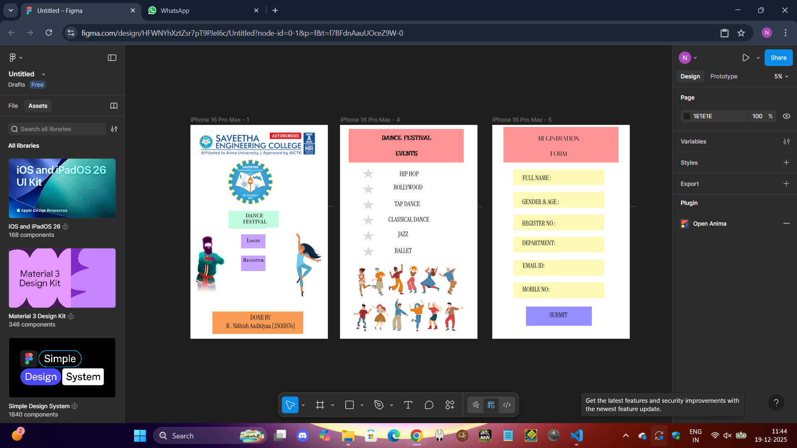

# Ex08 Event Registration Web Application
## Date:19-12-2025

## AIM:
To design, develop and deploy a web application for event registration using Figma UI tool.

## UI DESIGN TOOL:
Figma

## DESIGN STEPS:

### Step 1:
Use frames to represent screens or sections.

### Step 2:
Add column grids for consistent spacing and alignment.

### Step 3:
Insert shapes, text, buttons, and icons.

### Step 4:
Use Auto Layout for flexible, responsive design.

### Step 5:
Define color, text, and effect styles globally for consistency.

### Step 6:
Name layers logically and group related elements.

### Step 6:
Link frames to show navigation or interactions.

### Step 7:
Select the specific frame while generating code using Anima plugin.

## CODE:
```
page-1

index.html

<!DOCTYPE html>
<html>
  <head>
    <meta name="viewport" content="width=device-width, initial-scale=1" />
    <meta charset="utf-8" />
    <link rel="stylesheet" href="globals.css" />
    <link rel="stylesheet" href="style.css" />
  </head>
  <body>
    <div class="element-PAGE">
      
      
      
      
      
      
      
      <div class="DANCE-FESTIVAL">DANCE <br />FESTIVAL</div>
      <div class="div"></div>
      <div class="text-wrapper">Login</div>
      <div class="text-wrapper-2">Register</div>
      
      
      <div class="rectangle-3"></div>
    </div>
  </body>
</html>

globle.css

@import url("https://cdnjs.cloudflare.com/ajax/libs/meyer-reset/2.0/reset.min.css");
* {
  -webkit-font-smoothing: antialiased;
  box-sizing: border-box;
}
html,
body {
  margin: 0px;
  height: 100%;
}
/* a blue color as a generic focus style */
button:focus-visible {
  outline: 2px solid #4a90e2 !important;
  outline: -webkit-focus-ring-color auto 5px !important;
}
a {
  text-decoration: none;
}

styles.css

.element-PAGE {
  background-color: #ffffff;
  overflow: hidden;
  width: 100%;
  min-width: 5310px;
  min-height: 8267px;
  position: relative;
}

.element-PAGE .text-on-a-path {
  position: absolute;
  top: 5030px;
  left: 6619px;
  width: 5146px;
  height: 1455px;
}

.element-PAGE .image {
  top: 153px;
  left: 221px;
  width: 4705px;
  height: 1148px;
  aspect-ratio: 4.1;
  position: absolute;
  object-fit: cover;
}

.element-PAGE .img {
  top: 1301px;
  left: 1379px;
  width: 1878px;
  height: 1810px;
  aspect-ratio: 1.04;
  position: absolute;
  object-fit: cover;
}

.element-PAGE .rectangle {
  position: absolute;
  top: 3330px;
  left: 1466px;
  width: 1940px;
  height: 688px;
}

.element-PAGE .rectangle-2 {
  position: absolute;
  top: 4230px;
  left: 1954px;
  width: 944px;
  height: 544px;
}

.element-PAGE .DANCE-FESTIVAL {
  position: absolute;
  top: calc(50.00% - 740px);
  left: calc(50.00% - 1186px);
  width: 2041px;
  transform: rotate(0.06deg);
  font-family: "IM FELL French Canon SC-Regular", Helvetica;
  font-weight: 400;
  color: #000000;
  font-size: 200px;
  text-align: center;
  letter-spacing: 0;
  line-height: normal;
}

.element-PAGE .div {
  position: absolute;
  top: 5051px;
  left: 1954px;
  width: 944px;
  height: 598px;
  background-color: #c6a2ff;
}

.element-PAGE .text-wrapper {
  position: absolute;
  top: 4349px;
  left: 1968px;
  width: 934px;
  font-family: "IM FELL French Canon SC-Regular", Helvetica;
  font-weight: 400;
  color: #000000;
  font-size: 200px;
  text-align: center;
  letter-spacing: 0;
  line-height: normal;
}

.element-PAGE .text-wrapper-2 {
  position: absolute;
  top: 5106px;
  left: 1964px;
  width: 934px;
  font-family: "IM FELL French Canon SC-Regular", Helvetica;
  font-weight: 400;
  color: #000000;
  font-size: 200px;
  text-align: center;
  letter-spacing: 0;
  line-height: normal;
}

.element-PAGE .image-2 {
  top: 3973px;
  left: 2952px;
  width: 2358px;
  height: 2808px;
  aspect-ratio: 1;
  position: absolute;
  object-fit: cover;
}

.element-PAGE .image-3 {
  top: 4040px;
  left: 0;
  width: 1951px;
  height: 2497px;
  aspect-ratio: 1;
  position: absolute;
  object-fit: cover;
}

.element-PAGE .rectangle-3 {
  position: absolute;
  top: 7213px;
  left: 849px;
  width: 3507px;
  height: 863px;
  background-color: #fc9b52;
}

page-2

index.html

<!DOCTYPE html>
<html>
  <head>
    <meta name="viewport" content="width=device-width, initial-scale=1" />
    <meta charset="utf-8" />
    <link rel="stylesheet" href="globals.css" />
    <link rel="stylesheet" href="style.css" />
  </head>
  <body>
    <div class="box"><div class="rectangle"></div></div>
  </body>
</html>

globle.css

@import url("https://cdnjs.cloudflare.com/ajax/libs/meyer-reset/2.0/reset.min.css");
* {
  -webkit-font-smoothing: antialiased;
  box-sizing: border-box;
}
html,
body {
  margin: 0px;
  height: 100%;
}
/* a blue color as a generic focus style */
button:focus-visible {
  outline: 2px solid #4a90e2 !important;
  outline: -webkit-focus-ring-color auto 5px !important;
}
a {
  text-decoration: none;
}

styles.css

.box {
  width: 4443px;
  height: 1296px;
}

.box .rectangle {
  position: fixed;
  top: 159px;
  left: 332px;
  width: 4443px;
  height: 1296px;
  background-color: #ff9292;
}

page-3

index.html

<!DOCTYPE html>
<html>
  <head>
    <meta name="viewport" content="width=device-width, initial-scale=1" />
    <meta charset="utf-8" />
    <link rel="stylesheet" href="globals.css" />
    <link rel="stylesheet" href="style.css" />
  </head>
  <body>
    <div class="box"><div class="rectangle"></div></div>
  </body>
</html>

globals.css

@import url("https://cdnjs.cloudflare.com/ajax/libs/meyer-reset/2.0/reset.min.css");
* {
  -webkit-font-smoothing: antialiased;
  box-sizing: border-box;
}
html,
body {
  margin: 0px;
  height: 100%;
}
/* a blue color as a generic focus style */
button:focus-visible {
  outline: 2px solid #4a90e2 !important;
  outline: -webkit-focus-ring-color auto 5px !important;
}
a {
  text-decoration: none;
}

styles.css

.box {
  width: 4443px;
  height: 1373px;
}

.box .rectangle {
  position: fixed;
  top: 82px;
  left: 433px;
  width: 4443px;
  height: 1373px;
  background-color: #ff9292;
}

```

## OUTPUT:



## RESULT:
The program to design, develop and deploy a web application for event registration using Figma UI tool is completed successfully.
